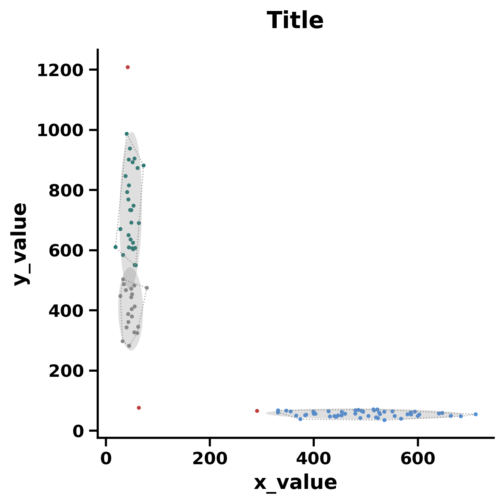

# 聚类散点图 - GraphPad 风格 (Clustered Scatter Chart GraphPad Style)

这是一个用于复刻 GraphPad Prism 风格聚类散点图的 matplotlib 示例，集成了 DBSCAN 聚类算法并支持自动参数估计。

## 📊 效果预览



## ✨ 核心特性

- **GraphPad 样式预设**：通过 `assets/clustered_scatter_chart.mplstyle` 实现了符合学术出版标准的字体、轴线粗-细、刻度方向等样式的全局接管。
- **自动聚类分析**：内置 `clustering_data` 函数，利用 DBSCAN 算法自动识别数据中的簇结构并进行着色。
- **智能参数估计**：使用 `estimate_eps` 函数（向量投影法/肘部法则）自动计算聚类所需的 `eps` 参数，无需繁琐的手动调参。

## 🚀 快速运行

确保你已经安装了 `matplotlib`、`numpy` 和 `scikit-learn`。然后在当前目录下运行：

```bash
python example.py
```

运行后，图表将自动生成并保存在 `./img/example.png`。此外代码还会同步输出一份 `.pdf` 格式文件以供高质量学术排版使用。

## 🛠️ 如何替换为你自己的数据？

打开 `example.py`，修改以下几个核心变量即可快速应用到你的研究数据中：

```python
# 1. 文本信息
title = 'Your Plot Title'
xlabel = 'Your X-axis Label'
ylabel = 'Your Y-axis Label'

# 2. 数据信息
# 将 x_data 和 y_data 替换为你自己的 NumPy 数组
x_data = np.array([...])
y_data = np.array([...])

# 3. 聚类敏感度
# 如果聚类结果不符合预期，可以调整 min_samples（形成簇所需的最小点数）
labels = clustering_data(x_data, y_data, min_samples=4)

# 4. 点的大小
r = 1  # 调整散点半径
```
